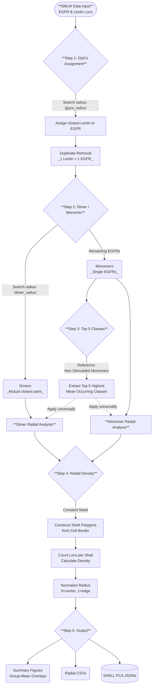

# Shell-based Hierarchical Evaluation of Localizations in Layers (SHELL) Analysis

**Author:** N. Yurekli | **Version:** 1.0 | **Last updated:** 2026-02-28

---

## What This Pipeline Does

SHELL quantifies **where** glycans are located on the cell surface relative to the cell edge and cell center, and whether that spatial pattern differs between two experimental groups (e.g. Stimulated vs. Non-Stimulated CD4+ T cells).

It uses GlyCO code to process single-molecule localisation microscopy (SMLM) data. Only glycans that co-cluster with the target protein (EGFR) within a defined search radius are included — all others are excluded. The pipeline then divides the cell into concentric radial shells (like rings on a target board, from center outward to the edge) and counts how many glycan-labelled proteins sit in each ring.

This is done separately for:
- **Monomeric EGFR** — single EGFR proteins not part of a dimer
- **Dimeric EGFR** — EGFR pairs detected within the dimer search radius

---

## Analysis Workflow (Step by Step)



### Step 1 — Glycan Assignment with Duplicate Removal (GlyCo)
Each lectin localisation is assigned to the **closest** EGFR protein within `glyco_radius` (default 35 nm). A duplicate-removal algorithm ensures each lectin point is assigned to exactly one protein — no lectin can be counted twice.

This step runs on **all** EGFR proteins before any monomer/dimer separation.

### Step 2 — Monomer / Dimer Separation
EGFR proteins are split into two populations:
- **Dimers** — mutual nearest-neighbour pairs within `dimer_radius` (default 36 nm)
- **Monomers** — all remaining EGFR proteins not participating in any dimer pair

### Step 3 — Top 5 Glycan Class Identification
The **Non-Stimulated monomer** population is used as the reference to rank glycan classes by mean normalised occurrence (counts per µm²). The Top 5 classes are then applied consistently to **both** monomers and dimers in both groups throughout the rest of the analysis.

### Step 4 — Radial Shell Density Analysis
For each cell:
1. A constant **cell mask** is built from all channels combined (union of all localisations)
2. The cell mask is eroded inward in steps of `bin_size_nm` (default 250 nm) to create concentric shell polygons
3. For each protein population (Total / Glycosylated / Non-Glycosylated / Top 5 classes), localisations are counted per shell and converted to density (localisations / µm²)
4. Densities are interpolated to a standard 100-point normalised radius (0 = center, 1 = edge) so cells of different sizes can be averaged together

### Step 5 — Summary Figures and Exports
Group-mean radial profiles and comparison figures are generated for all categories. PCA JSON files are exported for downstream analysis.

---

## SHELL PCA — Spatial + Compositional PCA

### What it is
Standard glycan PCA treats each class as a single value per cell (how much of that class is present). **SHELL PCA** adds the spatial dimension: each class is split into 20 spatial shells (Shell 0 = center → Shell 19 = edge), giving features like `WGA_Shell_3` or `AAL-WGA_Shell_17`.

Each cell becomes one row in the feature matrix:

```
           WGA_Shell_0  WGA_Shell_1  ...  WGA_Shell_19  SNA_Shell_0  ...
Cell_1        12.4         18.7               31.2          5.1
Cell_2         8.2         11.0               28.9          3.4
...
```

PCA then separates cells that differ in **both** which glycans are present **and** where they are enriched spatially — something a standard PCA cannot capture.

### Two PCA JSON types exported per cell

| File | Folder | Contents |
|------|--------|----------|
| `..._Lectin_Classes_per_sq-microns_for_PCA_37nm.json` | `PCA_JSONs/Glyco_PCA/` | **All glycan classes** (count / µm²) — one value per class. Use with standard PCA.py |
| `..._SHELL_PCA_37nm.json` | `PCA_JSONs/SHELL_PCA/` | **All glycan classes × 20 shells** (density per shell). Use with SHELL PCA analysis |

Both files exclude classes with a value of zero. Both include **all detected classes**, not just the Top 5.

### Top Contributing Features (Phase 4 in the notebook)
After running PCA on the SHELL PCA matrix, each principal component (PC) has a **loading** for every `Class_Shell_N` feature. The top 5 features by absolute loading for PC1 and PC2 tell you:
- **Which glycan class** drives the most variance between cells
- **Which shell position** (center / mid / edge) that class is most informative at

A positive loading means that feature is higher in one group; a negative loading means it is higher in the other. The score plot shows where each cell sits in PC1 vs PC2 space, coloured by group.

Outputs saved to `Summary_Figures/`:
- `SHELL_PCA_Analysis.pdf` — score plot + PC1/PC2 loading bar charts
- `SHELL_PCA_Top_Features.csv` — ranked table: PC, rank, glycan class, shell, loading value

---

## Output Files

### Per-cell (saved inside each cell's output folder)
| File | Description |
|------|-------------|
| `Monomer_Dashboard.pdf` | Maps + radial bar charts for all monomer categories |
| `Dimer_Dashboard.pdf` | Maps + radial bar charts for all dimer categories |
| `Total_EGFR_Dashboard.pdf` | Maps + radial bar charts for total EGFR |
| `Overall_Statistics.csv` | Counts: monomers, dimers, glycosylated, area |
| `..._Lectin_Classes_per_sq-microns_for_PCA_37nm.json` | Glyco PCA JSON (all classes) |
| `..._SHELL_PCA_37nm.json` | SHELL PCA JSON (all classes × 20 shells) |

### Summary (saved in `Summary_Figures/`)
| File | Description |
|------|-------------|
| `Summary_Cell_Masks_<group>.pdf` | All cell outlines with monomers (blue) and dimers (red) |
| `Summary_Radial_Monomers.pdf` | Group-mean monomer radial profiles (Total / Glyco / Non-Glyco) |
| `Summary_Radial_Dimers.pdf` | Group-mean dimer radial profiles |
| `Summary_Overlapped_Stim_NonStim.pdf` | Stim vs Non-Stim overlay (Monomers, Dimers, Total EGFR) |
| `Summary_Radial_Top5_Monomers.pdf` | Top 5 class radial profiles — monomers |
| `Summary_Radial_Top5_Dimers.pdf` | Top 5 class radial profiles — dimers |
| `Summary_Top5_BarChart_Monomer.pdf` | Mean occurrence bar chart — monomers |
| `Summary_Top5_BarChart_Dimer.pdf` | Mean occurrence bar chart — dimers |
| `Simple_Difference_Monomer.pdf` | Circular difference plot — monomers |
| `Simple_Difference_Dimer.pdf` | Circular difference plot — dimers |
| `SHELL_PCA_Analysis.pdf` | PCA score plot + PC1/PC2 top feature loadings |
| `SHELL_PCA_Top_Features.csv` | Ranked top contributing class+shell features per PC |
| `Summary_Cell_Statistics.csv` | Per-cell counts across all cells |
| `Radial_CSV_Data/` | All radial profiles as CSVs for external plotting |

### PCA JSON folders (`PCA_JSONs/`)
```
PCA_JSONs/
├── Glyco_PCA/
│   ├── Stimulated/
│   └── Non_stimulated/
└── SHELL_PCA/
    ├── Stimulated/
    └── Non_stimulated/
```

---

## Setup

This pipeline runs inside the `picassoenv` environment. Install the packages:

```bash
pip install scikit-image shapely colorama
```


---

## Running the Notebook (Recommended)

Use **`SHELL_Analysis_v2.0.ipynb`** — built directly from the working `.py` file with each step in a separate cell. Run cells in order; each cell prints `✓ ...` when it completes successfully.

| Cell | Content |
|------|---------|
| 1 | Imports & dependency check |
| 2 | Helper functions |
| **3** | **Configuration ← edit this before running** |
| 4 | Output folder structure & storage |
| 5 | Phase 1 — collect glyco-class frequencies |
| 6 | Top 5 selection & stats initialisation |
| 7 | Phase 2 — full radial analysis loop (per cell) |
| 8 | Phase 3 — summary cell masks |
| 9 | Phase 3 — radial comparison plots |
| 10 | Phase 3 — Top 5 radial summary & bar charts |
| 11 | Phase 3 — circular difference plots |
| 12 | Save statistics & radial CSVs |
| **13** | **Phase 4 — SHELL PCA (top contributing classes & layers)** |

---

## Configuration Parameters

Set these in **Cell 3** of the notebook (or the Configuration section of the `.py`):

| Parameter | Default | Description |
|-----------|---------|-------------|
| `root_dir` | — | Path to your dataset folder |
| `group_1_keyword` | `"Stimulated"` | Keyword in folder names for group 1 |
| `group_2_keyword` | `"Non_stimulated"` | Keyword in folder names for group 2 |
| `glyco_radius` | `37` | Lectin-to-EGFR assignment radius (nm) |
| `dimer_radius` | `36` | EGFR-to-EGFR dimer search radius (nm) |
| `bin_size_nm` | `250` | Radial shell width (nm) |
| `pixel_scale` | `130` | Camera pixel size (nm/px) |
| `number_to_plot` | `5` | Number of top glycan classes to display |

---

## Data Folder Structure

Each cell folder must be inside a subfolder whose name contains the group keyword:

```
root_dir/
├── Stimulated/
│   ├── Cell_01/
│   │   └── 90_Custom Centers/
│   │       ├── EGFR_cell01.hdf5
│   │       ├── WGA_cell01.hdf5
│   │       ├── SNA_cell01.hdf5
│   │       └── cell01.yaml         ← must contain cell area
│   └── Cell_02/
│       └── 90_Custom Centers/
│           └── ...
└── Non_stimulated/
    └── ...
```

The script searches recursively for folders named `90_Custom Centers` (set via `search_folder_name`).
